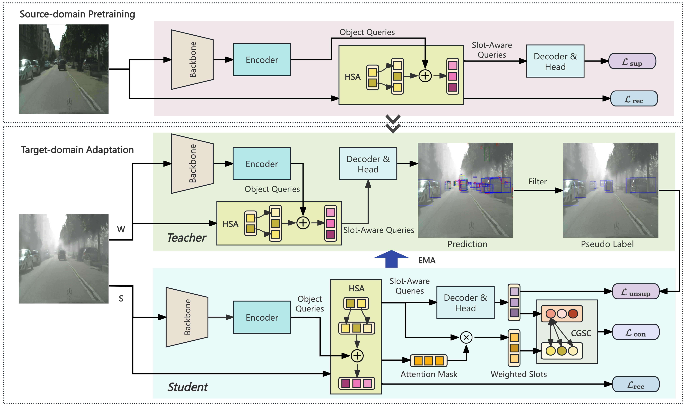

# CGSA: Class-Guided Slot-Aware Adaptation for Source-Free Object Detection

This repository provides the official implementation of the paper:

> **CGSA: Class-Guided Slot-Aware Adaptation for Source-Free Object Detections**  (ICLR 2026)

**CGSA** addresses Source-Free Domain Adaptive Object Detection (SFOD) by introducing a **Class-Guided Slot-Aware** adaptation framework built on [RT-DETR](https://github.com/lyuwenyu/RT-DETR). Below is our pipeline.




## Setup

```bash
# Clone the repository
git clone https://github.com/Michael-McQueen/CGSA.git
cd CGSA

# Install dependencies
conda create --name cgsa python=3.9
conda activate cgsa
pip install -r requirements.txt
```


## Dataset Preparation

Follow work on [DATR](https://github.com/h751410234/DATR) to prepare the dataset.

Modify the `img_path` and `ann_path` in the dataset configuration (configs/dataset).


## Training

The script runs two sequential stages:

1. **Stage 1 — Source-Domain Pretraining:** Train the detector on source-domain data with HSA enabled (no teacher model).
2. **Stage 2 — Target-Domain Adaptation:** Adapt the pretrained model to the target domain using the teacher–student framework with HSA and CGSC.


### Pre-trained Weights

We provide the HSA pre-trained weights on COCO dataset. You can also download it from the [Google Drive](https://drive.google.com/file/d/1x6Z8y9CftV2x7YhTmyL0u75fV3GPMQfd/view?usp=sharing). More details can be seen in the paper. After downloading, put it at:

```
importantpt/hsa.pt
```

Besides, we load the [pre-trained weights of RT-DETR](https://github.com/lyuwenyu/storage/releases/download/v0.1/rtdetrv2_r50vd_6x_coco_ema.pth) at the beginning of training. Place it at:

```
importantpt/rtdetrv2_r50vd_6x_coco_ema.pth
```


### Running Experiments

Run the script (default setting is Cityscapes → BDD100K):

```bash
bash run.sh
```

The script will:
1. Launch distributed training with `torchrun` (4 GPUs by default, configurable via `--nproc_per_node`).
2. After Stage 1 completes, automatically copy the best checkpoint and proceed to Stage 2.
3. Save logs to the `out/` directory and model outputs to the `output/` directory.


## Acknowledgements

This codebase is built upon [RT-DETR](https://github.com/lyuwenyu/RT-DETR). We thank the authors for their excellent work.


## Citation

If you find this work useful, please cite our paper:

